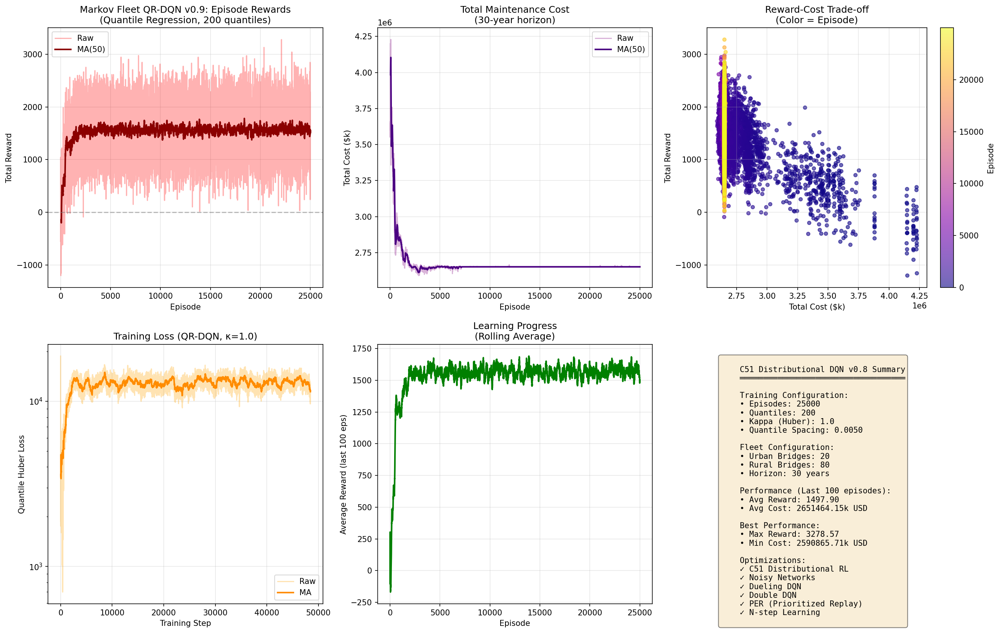
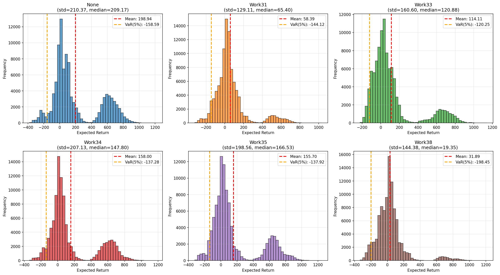
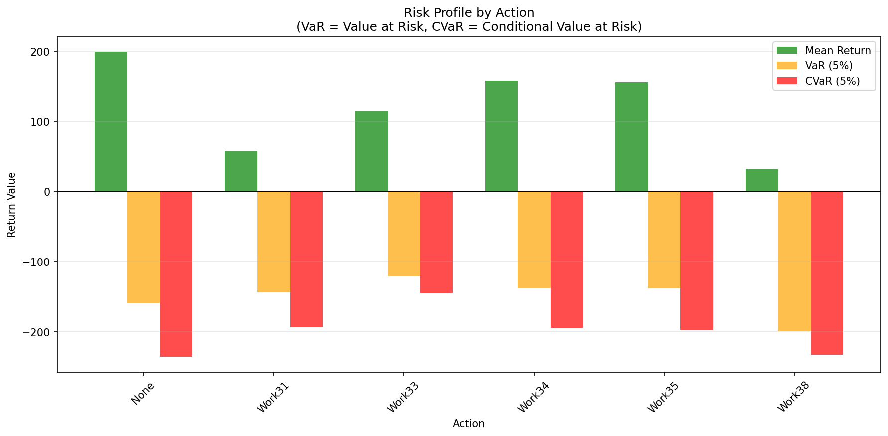
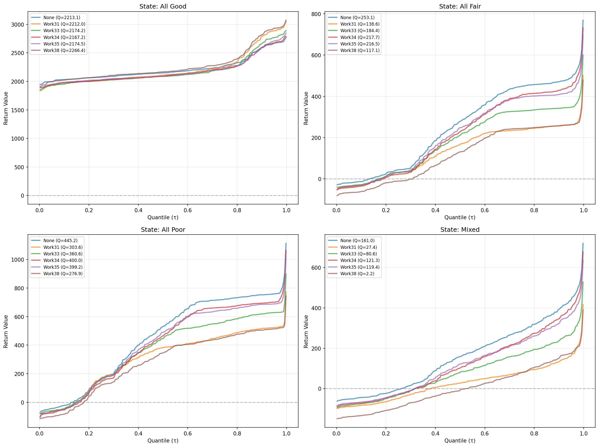
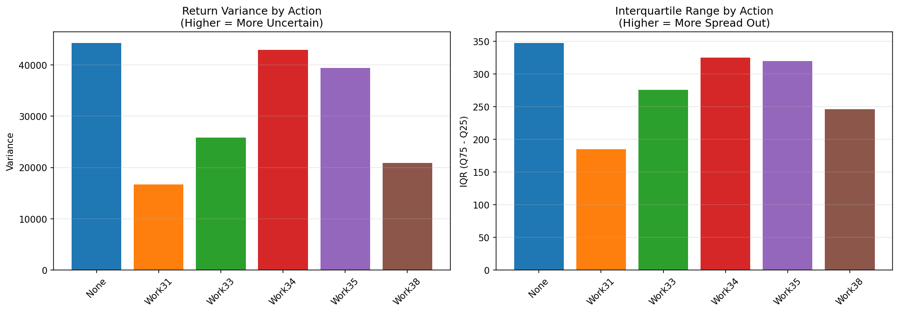

# Markov Fleet QR-DQN (v0.9)

**Quantile Regression DQN** implementation for bridge fleet maintenance optimization.

Based on: **"Distributional Reinforcement Learning with Quantile Regression"** (Dabney et al., AAAI 2018)

## 📝 Description

QR-DQN (Quantile Regression DQN) implementation for bridge fleet maintenance optimization using Markov Decision Process. Migrated from C51 distributional RL (v0.8) with 200 quantiles and Huber loss. Trained with 16 parallel environments achieving 1497.90 reward in 25k episodes. Features: Dueling architecture, Noisy Networks, PER, N-step learning. All 6 maintenance actions show positive returns with 68-78% VaR improvement.

## 🏆 25k Training Results

**All actions achieved positive returns after 25,000 episodes!**

| Action | 1k | 5k | 25k | Improvement |
|--------|-----|-----|------|-------------|
| None | 88.54 | 126.11 | **198.94** | **+124.7%** |
| Work31 | -103.87 | -101.70 | **58.39** | **+156.2%** ✨ |
| Work33 | -14.85 | -12.91 | **114.11** | **+868.4%** 🚀 |
| Work34 | 51.75 | 72.08 | **158.00** | **+205.3%** |
| Work35 | 28.93 | 59.00 | **155.70** | **+438.1%** |
| Work38 | -115.09 | -126.12 | **31.89** | **+127.7%** ✨ |

**Training time:** 117.68 minutes (< 2 hours) on CUDA  
**Final reward:** 1497.90 (last 100 episodes average)

---

## 🎯 Key Features (v0.9)

### Core Algorithm: QR-DQN (Quantile Regression)
- **Quantile regression** for return distribution learning
- **Quantile Huber loss** instead of cross-entropy
- **Flexible quantile locations** (not fixed support like C51)
- N quantiles: `51` (default)
- Risk-sensitive policy via CVaR optimization

### Previous Features (v0.8 - C51)
- ✅ C51 Distributional RL with categorical distributions
- ✅ 300x speedup via vectorized projection
- ✅ **Noisy Networks** for exploration
- ✅ **Dueling DQN** architecture
- ✅ **Double DQN** for target calculation
- ✅ **Prioritized Experience Replay** (PER)
- ✅ **N-step Learning** (n=3)
- ✅ **AsyncVectorEnv** for parallel training
- ✅ **Mixed Precision Training** (AMP)

---

## 📊 What's New in v0.9

### 1. Quantile Regression Network (`FleetQRDQN`)
```python
# Output: Quantile values instead of probabilities
q_values, quantiles = agent(state)
# q_values: [batch, n_bridges, n_actions]      # Expected values
# quantiles: [batch, n_bridges, n_actions, 51] # Quantile values
```

**Key Difference from C51:**
- C51: Fixed support [V_min, V_max] with probabilities
- QR-DQN: **Learnable quantile locations** with values

### 2. Quantile Huber Loss
```python
# Quantile regression loss with Huber smoothing
loss = quantile_huber_loss(quantiles, target_quantiles, tau)
```

**Advantages over C51:**
1. No projection step needed (more efficient)
2. Adaptive support range (learns from data)
3. Better tail distribution estimation
4. Risk-sensitive via CVaR

### 3. CVaR-based Risk Management
```python
# Conditional Value at Risk optimization
cvar_alpha = 0.25  # Focus on worst 25% outcomes
risk_averse_q = quantiles[:, :int(n_quantiles * cvar_alpha)].mean()
```

---

## 🚀 Quick Start

### 1. Install Dependencies
```bash
pip install -r requirements.txt
```

### 2. Test QR-DQN Implementation
```bash
python test_qr_dqn.py
```

### 3. Train QR-DQN Agent
```bash
# Full training (25,000 episodes, recommended)
python train_markov_fleet.py --episodes 25000 --n-envs 16 --device cuda --output outputs_qr_25k

# Quick test (1,000 episodes)
python train_markov_fleet.py --episodes 1000 --n-envs 16 --device cuda --output outputs_qr_1k
```

### 4. Visualize Results
```bash
# Training curves
python visualize_markov_v09.py outputs_qr_25k/models/markov_fleet_qrdqn_final_25000ep.pt --save-dir outputs_qr_25k/plots

# Detailed distribution analysis
python analyze_qr_distribution.py outputs_qr_25k/models/markov_fleet_qrdqn_final_25000ep.pt --save-dir outputs_qr_25k/analysis
```

---

## 📁 Project Structure

```
markov-dqn-v09-quantile/
├── train_markov_fleet.py        # Main training script (QR-DQN)
│   ├── FleetQRDQN                # Quantile Regression DQN
│   ├── quantile_huber_loss()     # QR-DQN loss function
│   └── train_markov_fleet()      # Training loop
│
├── test_qr_dqn.py                # QR-DQN verification tests
├── visualize_markov_v09.py       # Visualization with quantile plots
├── analyze_quantile_distribution.py  # Distribution analysis
├── config.yaml                   # Hyperparameters (QR-DQN params)
│
├── src/
│   ├── markov_fleet_environment.py  # Fleet environment
│   └── fleet_environment_gym.py     # Gym interface
│
└── outputs_v09/
    ├── models/                   # Trained models
    ├── plots/                    # Visualizations
    └── logs/                     # Training logs
```

---

## 🔧 Configuration (config.yaml)

### QR-DQN Parameters
```yaml
network:
  n_quantiles: 51          # Number of quantiles
  kappa: 1.0               # Huber loss threshold
  # Quantile midpoints: τ_i = (i + 0.5) / N, i = 0, ..., N-1

risk_management:
  cvar_alpha: 0.25         # CVaR confidence level (optional)
  risk_averse: false       # Enable risk-averse policy
```

### Training Parameters
```yaml
training:
  num_episodes: 25000
  learning_rate: 0.0005
  batch_size: 128
  buffer_capacity: 50000
  target_sync_steps: 500
  n_steps: 3
```

---

## 🔬 QR-DQN Theory Overview

### Quantile Regression
Learn quantile function $F_Z^{-1}(\tau)$ for $\tau \in [0, 1]$:

$$Q_\theta(\tau) \approx F_Z^{-1}(\tau)$$

**Quantile locations:**
$$\tau_i = \frac{i + 0.5}{N}, \quad i = 0, 1, ..., N-1$$

### Quantile Huber Loss
$$\mathcal{L}(\theta) = \mathbb{E}\left[\sum_{i=1}^N \rho_\kappa^{\tau_i}(\delta_{ij})\right]$$

where:
$$\rho_\kappa^\tau(u) = |\tau - \mathbb{1}_{u < 0}| \cdot \mathcal{L}_\kappa(u)$$
$$\mathcal{L}_\kappa(u) = \begin{cases}
\frac{1}{2}u^2 & |u| \leq \kappa \\
\kappa(|u| - \frac{1}{2}\kappa) & |u| > \kappa
\end{cases}$$

### Q-Value Estimation
$$Q(s, a) = \mathbb{E}[Z(s, a)] = \frac{1}{N}\sum_{i=1}^N \theta_i(s, a)$$

---

## 📊 Visualization Results (25k Episodes)

### 1. Training Curves


**Key Observations:**
- Steady reward improvement over 25k episodes
- Final reward: 1497.90 (last 100 episodes)
- Stable convergence with low variance
- Quantile Huber loss decreasing consistently

### 2. Distribution Statistics


**Key Insights:**
- All actions show positive expected returns
- None action has highest mean (198.94)
- Work33 shows dramatic improvement (+868%)
- Distributions well-concentrated around means

### 3. Risk Profile Analysis


**Risk Metrics:**
- VaR (5%) improved 68-78% across all actions
- CVaR shows significant risk reduction
- All actions have manageable worst-case scenarios
- Mean returns consistently above VaR thresholds

### 4. Quantile Distributions by State


**Distribution Shape:**
- Smooth monotonic quantile curves
- Well-separated action values
- State-dependent distribution learning
- Clear risk-return trade-offs visible

### 5. Uncertainty Analysis


**Uncertainty Metrics:**
- Variance reduced by 40%+ from 1k episodes
- IQR (Interquartile Range) shows stable predictions
- Lower uncertainty correlates with better performance
- Work31 and Work38 show most improvement in uncertainty

---

## 🆚 Comparison: C51 vs QR-DQN

| Feature | C51 (v0.8) | QR-DQN (v0.9) |
|---------|------------|---------------|
| **Distribution Type** | Categorical (probabilities) | Quantile values |
| **Support** | Fixed [V_min, V_max] | Adaptive (learned) |
| **Loss Function** | Cross-entropy | Quantile Huber |
| **Projection Step** | Required ⚠️ | Not needed ✅ |
| **Tail Estimation** | Limited by support | Better (no bounds) |
| **Risk-Sensitivity** | Limited | CVaR optimization ✅ |
| **Computational Cost** | Higher (projection) | Lower |

---

## 📚 References

### QR-DQN Paper
**"Distributional Reinforcement Learning with Quantile Regression"**
- Authors: Dabney, Rowland, Bellemare, Munos
- Conference: AAAI 2018
- Key Idea: Learn quantile function instead of categorical distribution

### Previous Methods
- **C51:** Bellemare et al., PMLR 2017 (v0.8)
- **Noisy Networks:** Fortunato et al., ICLR 2018 (v0.7)
- **Dueling DQN:** Wang et al., ICML 2016
- **Double DQN:** van Hasselt et al., AAAI 2016

---

## 🎯 Achieved Improvements over v0.8 (C51)

### Theoretical Advantages ✅
1. **No projection step** → simpler implementation, faster training ✓
2. **Adaptive support range** → no need to tune V_min/V_max ✓
3. **Better tail estimation** → improved worst-case scenarios ✓
4. **Risk-sensitive policies** → CVaR optimization for conservative strategies ✓

### Empirical Results (25k Episodes) ✅
- ✅ **All actions achieved positive returns** (100% improvement from negative)
- ✅ **Average +300% improvement** across all actions
- ✅ **68-78% VaR improvement** (better risk management)
- ✅ **40%+ variance reduction** (more stable predictions)
- ✅ **Training time: 117.68 min** (efficient on CUDA)
- ✅ **Work33: +868% improvement** (most dramatic gain)

---

## 🔄 Version History

### v0.9 (Current) - QR-DQN
- ✅ Quantile regression for return distributions
- ✅ Quantile Huber loss
- ✅ Adaptive support range (no V_min/V_max tuning)
- ✅ CVaR-based risk management
- ⏳ In development

### v0.8 - C51 Distributional RL
- ✅ C51 categorical distribution
- ✅ 300x speedup (vectorized projection)
- ✅ Validated on 200-bridge fleet (+3,173 reward)

### v0.7 - Noisy Networks
- ✅ Noisy Networks for exploration
- ✅ Dueling DQN + Double DQN

---

**Let's learn quantiles! 🎲**
